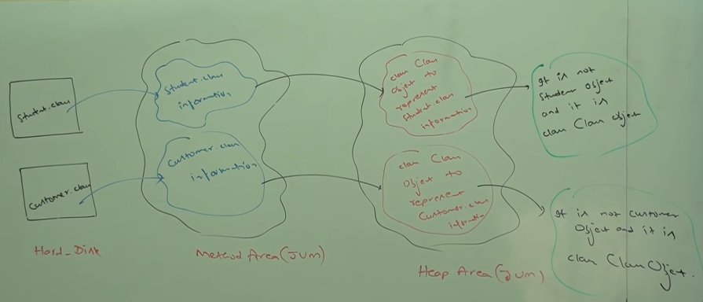
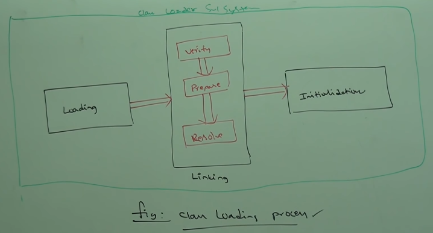
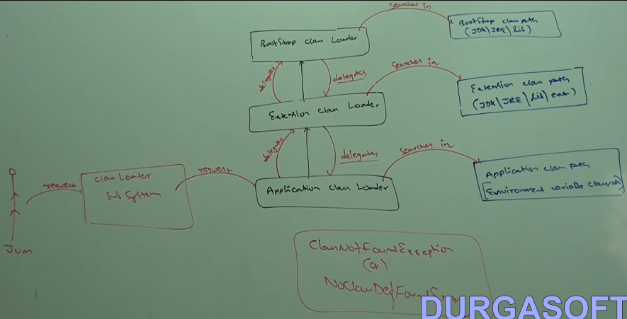
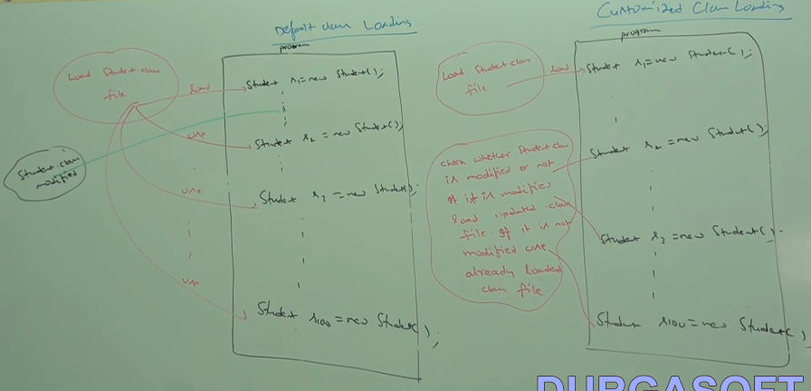
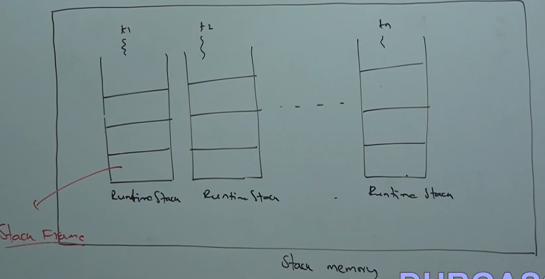
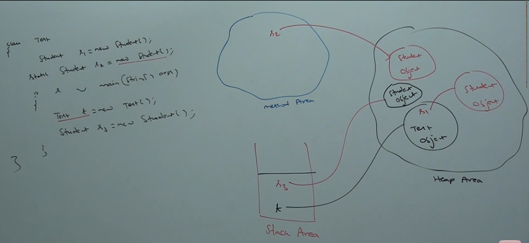
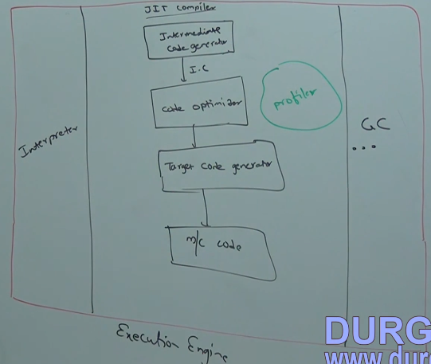

# INDEX

- Virtual Machine
    - Types of Virtual Machines
        - Hardware Based
        - Application Based

- Basic Architecture of JVM

- Class Loader Subsystem
    - Loading
    - Linking
    - Initialisation
    - Types of Class Loaders
        - Bootstrap
        - Extension
        - Application
    - How class loader works
    - Need for customised class loader
    - Pseudo code for customised class loader

- Various Memory Areas of JVM
    - Method
    - Heap
        - Program to display heap memory statistics
        - How to set maximum and minimum heap size
    - Stack
    - PC Registers
    - Native Method stacks

- Execution Engine
    - Interpreter
    - JIT Compilers

- Java Native Interface (JNI)

- Complete Architecture Diagram of JVM

- Class File Structure

# VIRTUAL MACHINE

- It is a software simulation of a machine which can perform operations like a
physical machine
- Types:
    - Hardware Based or System Based
    - Application Based or Process Based

## HARDWARE OR SYSTEM BASED VIRTUAL MACHINE

- It provides several logical system on the same computer with strong isolation
from each other
- Advantage is hardware resource sharing and improves utilisation of hardware
resources
- For eg. KVM (Kernel-based Virtual Machine for Linux system), VMWare, Xen

## APPLICATION OR PROCESS BASED VIRTUAL MACHINE

- Act as runtime engines to run a particular programming language applications
- For eg. JVM (Java Virtual Machine - acts as runtime engine to run Java based
applications), PVM (Perl Virtual Machine), CLR (Common Language Runtime acts as
runtime engine to run .NET Based applications)

# JVM

- JVM is a part of JRE
- It is responsible to load and run Java class files

# BASIC ARCHITECTURE DIAGRAM OF JVM

- 

# CLASS LOADER SUBSYSTEM

- Resposible for 3 activities:
    - Loading
    - Linking
    - Initialisation

## LOADING

- Reading class files and store corresponding binary data in method area
- For each .class file the JVM will store the corresponding information in
memory area:
    - Fully qualified name of class
    - Fully qualifief name of immediate parent class
    - Methods information
    - Variable information
    - Constructor information
    - Modifiers information
    - etc...

- After loading .class file immediately JVM creates an object for that loaded
class in heap memory of type `java.lang.Class`



- `Class` object can be used by programmer to get class level information 
(number of methods, constructors, variables, etc.)

- For every loaded type only 1 `Class` object will be created even though we are
using the class multiple times in our program


```
Student.class -> loads into -> Method area (JVM) -> creates -> class Class
object to represent Student class information inside Heap Area (JVM)
```

## LINKING

- Consists of 3 activities:
    - Verify
    - Prepare
    - Resolve

### VERIFY

- It is the process of ensuring that binary representation of a class is
structuraly correct or not, that is JVM will check the .class file is generated
by a valid compiler or not (the .class file should be properly formatted)
- Internally bytecode verifier is responsible for this activity (part of class
loader subsystem). If verification fails then we will get runtime exception `java.lang.VerifyError`

### PREPARE

- In this phase JVM will allocate memory for class level static variables and
assign default values
- NOTE - In Initialisation phase original values will be assigned to the static
variables

### RESOLVE

- It is the process of replacing symbolic names in our program with original
memory references from method area
- The symbolic names are stored in constant pool of main class

[!Student class Demo](./Student.java)

## INITIALISATION

- In this phase, all static variables are assigned with original values and
static blocks will be executed from parent to child, and from top to bottom



- While loading, linking, or initialisation if any error occurs, then we will
get runtime exception saying `java.lang.LinkageError`

## TYPES OF CLASS LOADERS

- 3 types:
    - Boostrap or Premordial
    - Extension
    - Application or System

### BOOTSTRAP CLASS LOADER

- It is resposible to load core Java API classes from Boostrap classpath, for
eg. the classes present in `rt.jar` (JDK -> JRE -> lib -> rt.jar - This 
location is called Boostrap classpath)
- It is available with every JVM
- It is implemented in native languages like C/C++ and not implemented in Java

### EXTENSION CLASS LOADER

- Child class of Boostrap classloader
- It is responsible to load classes from extension classpath (JDK -> JRE -> lib
-> ext -> *.jar - This location is called Extension classpath)
- Extension classloader is implemented in Java and corresponding .class file is
`sun.misc.launcher$ExtClassLoader.class`

### APPLICATION OR SYSTEM CLASS LOADER

- Child class of Extension classloader
- It is responsible to load classes from application classpath
- It internally uses environment variable `CLASSPATH`
- Implemented in Java and corresponding classfile is
`sun.misc.Launcher$AppClassLoader.class`

## HOW CLASSLOADER WORKS

- 

- Class loader follows Delegation Hierarchy Principle. Whenever JVM comes across
a particular class, first it will check whether the corresponding .class file is
already loaded or not. If it is already loaded in method area, then JVM will
consider that loaded class. If it is not loaded then JVM request class loader
subsystem to load that particular class. Then Class load subsystem handovers the
request to Application Classloader, which delegates the request to Extension
classloader, which inturn delegates the request to Bootstrap classloader. The
Boostrap classloader will search in Boostrap classpath. If it is available then
the corresponding .class file will be loaded by Boostrap classloader. If it is
not available then boostrap classloader delegates the request to Extension
classloader. Extension classloader will search in Extension classpath. If it is
available then it will be loaded, otherwise Extension classloader delegates the
request to Application classloader, which searches in Application classpath. If
it is available then it will be loaded otherwise we will get runtime exception
`NoClassDefFoundError` or `ClassNotFoundException`

- Use `<classname>.getClassLoader()` to get the object of the Class Loader which
is loading the class `<classname>` (We will get `null` for Boostrap class loader
object because it is not implemented in Java)

- Class loader priority order - Boostrap > Extension > Application

## NEED FOR CUSTOMISED CLASS LOADER

- Default class loaders will load .class file only once even if we are using it
multiple times in our program. After loading that .class file if it is modified
outside then default classloader won't load updated version of class file (as
this .class file will already be availabe in method area). We can solve this 
problem by defining our own custom class loader. The main advantage of custom
class loader is we can control class loading mechanism based on our requirement.
For eg. we can load .class file separately everytime so that updated version is
available to our program



## HOW TO DEFINE CUSTOMISED CLASS LOADER

- By extending `java.lang.ClassLoader` class
```java
public class CustClassLoader extends ClassLoader {
    public Class loadClass(String cname) throws ClassNotFoundException {
        // check for updates and load updated .class file
        // return corresponding Class
    }
}
class Client {
    public static void main(String[] args) {
        Dog d1 = new Dog();     // loaded by default class loader
        CustClassLoader cl = new CustClassLoader();
        cl.loadClass("Dog");    // loaded by customised class loader
        cl.loadClass("Dog");    // loaded by customised class loader
    }
}
```

- While developing web server and application servers usually we can go for
customised class loaders

- What is the need of `java.lang.ClassLoader` class?
    - Used to define our own customised class loaders
    - Every class loader in Java should be child class of this class either
    directly or indirectly. Hence this class acts as base class for all class
    loaders

# VARIOUS MEMORY AREAS OF JVM

- Whenever JVM loads and runs a Java program it needs memory to store several
things like bytecode, objects, variables, etc. 
- Total JVM memory is organised into 5 categories:
    - Method Area
    - Heap Area
    - Stack Memory
    - PC Registers
    - Native Methods Stacks

## METHOD AREA

- For every JVM one method area will be available
- Method area will be created at the time of JVM startup
- Inside method area class level binary data including static variables will be
stored
- Constant pools of a class will be stored inside method area
- It can be accessed by multiple threads simulatenously
- It need not be contiguous

## HEAP AREA

- For every JVM one heap area is available
- Heap are will be created at the time of JVM startup
- Inside heap area objects and corresponding instance variables will be stored 
- Every array in Java is object only. Hence arrays also will be stored in the
heap area
- It can be accessed by multiple threads and hence data stored in heap memory is
not thread safe
- It need not be continuous

### PROGRAM TO DISPLAY HEAP MEMORY STATISTICS

- A Java application can communicate with JVM by using Runtime object
- Runtime class is present in `java.lang` package and it is a singleton class
- We can create Runtime object, and call the following methods and object
```java
r.maxMemory();  // returns the number of bytes of max memory allocated to heap
r.totalMemory();  // returns the number of bytes of total memory allocated to
                    // heap (initial memory)
r.freeMemory(); // returns number of bytes of free memory present in the heap
```

- 

### HOW TO SET MAXIMUM AND MINIMUM HEAP SIZE

- Heap memory is finite. But based on our requirement we can set maximum and
minimum heap sizes. Use the following flags with `java` command
`java -xmx512m HeapDemo` - Maximum memory set as 512MB
`java -xms10m HeapDemo` - Minimum memory set as 10MB

## STACK MEMORY

- For every thread JVM will create a separate stack at the time of thread
creation
- Each method call performed by the thread will be stored in the stack including
local variables
- After completing a method the corresponding entry from the stack will be
removed
- After completing all method calls the stack will become empty and that empty
stack will be destroyed by the JVM just before terminating the thread
- Each entry in the stack is called Stackframe or Activation Record
- The data stored in the stack is available for the corresponding thread only,
and not available to the remaining threads. Hence this data is thread safe


### STACK FRAME STRUCTURE

- Each stackframe contains 3 parts:
    - Load variable array
    - Operand stack
    - Frame data

#### LOCAL VARIABLE ARRAY

- It contains all parameters and local variables of the method
- Each slot in the array is of 4 bytes
- Values of type `int`, `float`, and reference occupy 1 entry in the array
- Values of type `double` and `long` occupy 2 consecutive entries in the array
- Value of type `byte`, `short` and `char` values will be converted to `int` 
before storing and occupy 1 cell
- The way of storing `boolean` value varies across JVM. But most JVMs follow 1
slot for `boolean` values


#### OPERAND STACK

- JVM uses operand stack as workspace
- Some instructions can push the values to the operand stack, and some others
instructions can pop values from the operand stack, and some instructions can
perform required operations

#### FRAME DATA

- It contains all symbolic references related to that method
- It also contains a reference to exception table which provides corresponding
catch block information in the case of exceptions

## PC REGISTERS

- For every thread a separate PC register will be created at the time of thread
creation
- They contain the address of current executing instruction
- Once instruction execution completes automatically PC register will be
incremented to hold address of next instruction

## NATIVE METHOD STACKS

- For every thread JVM will create a separate native method stack
- All native method calls invoked by the thread will be stored in the
corresponding native method stack

## CONCLUSIONS

- Method area, Heap area and stack area are considered as important memory areas
with respect to programmer
- Method area and Heap area are per JVM, whereas Stack area, PC register and
Native Method Stack are per thread
- Static variables will be stored in method area, Instance variables will be
stored in heap area; Local variables will be stored in stack area
- In the below program, Student objects (created by executing Student()) will be
stored in Heap area, and variables s2 will be created in Method Area and will
point to the memory occupied by the Student object

```java
class Test {
    Student s1 = new Student();
    static Student s2 = new Student();
    public static void main(String[] args) {
        Test t = new Test();
        Student s3 = new Student();
    }
}
```

# EXECUTION ENGINE

- Responsible to execute Java class files
- Contains two components
    - Interpreter
    - JIT Compiler

## INTERPRETER

- Responsible to read byte code and interpret into machine code, and execute it
line by line
- The problem is it interprets everytime even same method invoked multiple times
which reduces performance of the system. To overcome this problem JIT compilers
were introduced

## JIT COMPILERS

- Main purpose is to improve performance
- Internally it maintains a separate count for every method. Whenever JVM comes
across any method call, first that method will be interpreted normally by the
interpreter, and JIT compiler increments the corresponding count variable. This
process will be continued for every method. Once any method count reaches a
threshold value then JIT compiler identifies that method is repeatedly used
method (Hot spot). Immediately JIT compiler compiles that method and generates
the corresponding native code. Next time JVM comes across that method call then
JVM uses native code directly and executes it instead of interpreting once again
so that performance of the system will be improved
- The threshold count varies across JVMs
- Some advanced JIT Compilers will recompile generated native code if count
reaches a threshold value second time so that more optimised machine code will
be generated
- Internally profiler, which is part of JIT Compiler, is responsible to identify
hot spots
- Note - JVM interprets total program at least once
- JIT Compilation is applicable only for repeatedly required methods, and not
for every method


# JAVA NATIVE INTERFACE (JNI)

- Acts as mediator for Java method calls and corresponding native libraries
- JNI is responsible to provide information about native libraries to the JVM
- Native method library holds native libraries information

# CLASS FILE STRUCTURE

- Different parts of class file:
    - magic_number - The first 4 bytes of classfile is magic number. It is a
    predefined value used by JVM to identify if .class file is generated by a 
    valid compiler or not. The value should be 0XCAFEBABE. Whenever we are
    executing a Java class, if JVM is unable to find valid magic number, then we
    will get runtime exception saying `java.lang.ClassFormatError`
    - major_version
    - minor_version - Represents .class file version. JVM will use these
    versions to identify which version of compiler generates the current .class
    file - `javac 1.6v -> java 1.7v` - M.m (Major version.Minor version). Lower
    version compiler generated .class file can be run by higher version JVM, but inverse is not possible. If we are trying to run we will get Runtime
    Exception saying `UnsupportedClassVersionError` (1.5v - 49.0; 1.6v - 50.0;
    1.7v - 51.0)
    - constant_pool_count - Represents number of constants present in constant
    pool
    - constant_pool[] - Represents information about constants present in
    constant pool
    - access_flags - Provides information about modifiers which are declared to
    the class
    - this_class - Represents fully qualified name of the class
    - super_class - Represent fully qualified name of the immediate super class
    of current class
    - interface_count - Returns number of interface implemented by current class
    - interface[] - Returns interface information implemented by current class
    - fields_count - Represents (static variables) in current class
    - fields[] - Represents static variable information in current class
    - methods_count - Represents number of methods in current class
    - methods[] - Information about methods in current class
    - attributes_count - Number of instance variables in current class
    - attributes[] - Information about instance variables in current class

- `javap -verbose Test.class`